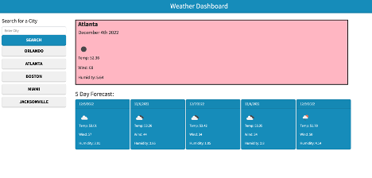

# Weather Dashboard

## Description

As a traveler, you may want a weather outlook for multiple cities so that you can plan a trip accordingly. This weather dashboard takes user input to search for a City, and then presents current and future conditions including: the city name, the date, an icon representation of weather conditions, the temperature, the humidity, and the wind speed using a 5 Day Weather Forecast API.

This program fetches coordinates associated with the searched city, and then passes those coordinates into an API call to retrieve the weather conditions.

Additionally, the localStorage is used to store persistent data for previously searched cities to ensure easy recall.

## Screenshot

## Deployed Application Link

https://alissacohan18.github.io/Weather-Dashboard/

## Built With
* HTML
* CSS
* JavaScript
* JQuery
* Moment.JS
* BootStrap
* Server-Side API

## Credits
N/A
